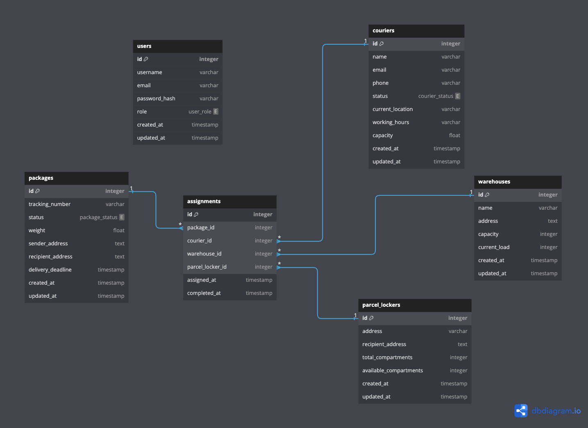

# BoxNinja Webapp

## Database



---

## Prerequisites

Before you begin, ensure you have the following installed on your computer:

1. **Python**: This project requires Python 3.8 or newer. Download it from [python.org](https://www.python.org/downloads/).

2. **Git**: You'll need Git to clone the repository. Download it from [git-scm.com](https://git-scm.com/downloads).

3. **Docker**: You'll need Docker for free local e-mailing. Download it from [docker.com](https://www.docker.com/).

## Setup Instructions

Follow these steps to set up the project on your local machine:

1. **Open a terminal or command prompt**
   - On Windows, you can use Command Prompt or PowerShell
   - On macOS or Linux, use the Terminal

2. **Clone the repository**
   ```
   git clone [repository-url]
   cd [repository-name]
   ```
   Replace `[repository-url]` with the actual URL of the Git repository, and `[repository-name]` with the name of the created folder.

3. **Create a virtual environment**
   - On Windows:
     ```
     python -m venv venv
     venv\Scripts\activate
     ```
   - On macOS and Linux:
     ```
     python3 -m venv venv
     source venv/bin/activate
     ```

4. **Install the required packages**
   ```
   pip install -r requirements.txt
   ```

5. **Set up the database**
   ```
   flask db init
   flask db migrate
   flask db upgrade
   python seed.py  # fill database with random data
   ```

6. **Create a `.env` file**

   Copy the `.env.example` file and rename the copy to `.env`.
   Replace `your-secret-key` with a random string of characters.

7. **Setup mailhog**
   For the ability to send e-mails locally, we use mailhog with docker:
   ```
   docker-compose up -d
   ```
   You can access the e-mail interface at: `http://127.0.0.1:1025`

8. **Run the application**
   ```
   flask --debug run
   ```
   Alternatively, you can set an other port if needed:
   ```
   flask --debug run --port 3000
   ```

9.  **Access the application**
   Open a web browser and go to `http://127.0.0.1:5000`

## Troubleshooting

If you encounter any issues during the setup process, try the following:

1. Make sure you're in the correct directory (the root of the project) when running commands.
2. Ensure that you've activated the virtual environment before running any `pip` or `flask` commands.
3. If you get a "command not found" error, try using `python -m flask` instead of just `flask`.

If you're still having trouble, please contact the development team for assistance.

## Project Structure

```
project_root/
├── app/
│   ├── models/         # Database models
│   ├── routes/         # Route handlers
│   ├── templates/      # HTML templates
│   └── static/         # Static files (CSS, JS)
├── migrations/         # Database migration files
├── .env                # Environment variables
├── config.py           # Configuration settings
├── requirements.txt    # Project dependencies
└── run.py              # Application entry point
```

## Next Steps

After setting up the project, you can start exploring the codebase and adding new features or modifications as needed. Refer to the Flask documentation (https://flask.palletsprojects.com/) for more information on how to work with Flask applications.